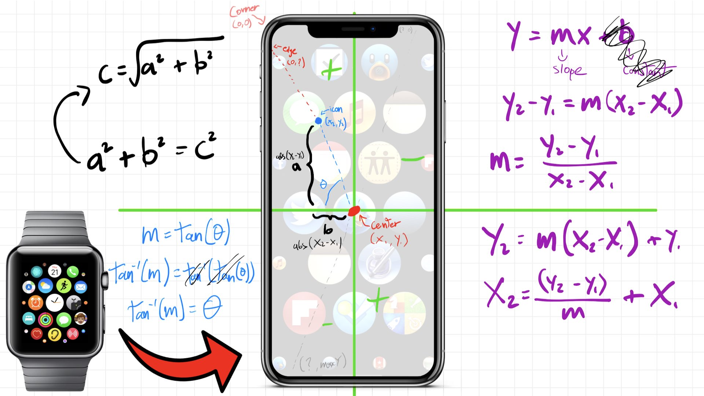

# Apple Watch Home Layout ⌚️
In these series of videos, we will build an Apple Watch Home Layout using pure SwiftUI. Additionally, we'll learn about Lazy Grids and Geometry Readers, which will help up to build the view and animations.

## Part 1: Lazy Grids
[Link to the video](https://youtu.be/tcOlekjPm6M)

In this video we will learn about lazy grids in SwiftUI and building an Apple Watch home layout with retro icons. 📺

## Part 2: Geometry Reader + Maths to generate Apple Watch's home animation
[Link to the video](https://youtu.be/ma4LP8RnyI0)

In this one, we going to learn what is Geometry Reader in SwiftUI and how you can use it to build apple watch animation when icons are far away from the center.

Be prepared to remember your geometry classes at the school 😉!

## Requirements
- Xcode 13+
- iOS 15+
- Swift 5.5+

Check out [Swift && Tips](https://www.youtube.com/c/SwiftandTips) in youtube for more about Swift and SwiftUI, and my Twitter for daily updates & content [@swiftandtips](https://twitter.com/swiftandtips).
